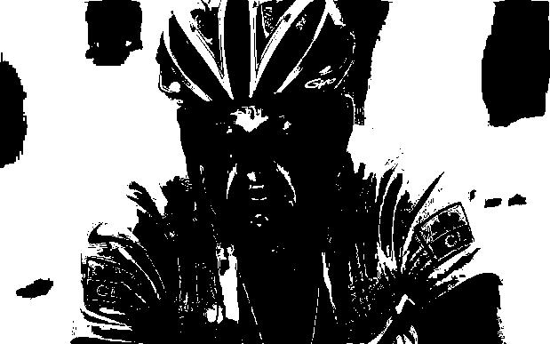

<H1>Descrição do Desafio</H1>
Seguindo o exemplo do algoritmo de binarização apresentado em nossa última aula, realize a implementação em Python para transformar uma imagem colorida para níveis de cinza (0 a 255) e para binarizada (0 e 255), preto e branco.

Antes de rodar o sistema pip install requirements.txt para instalar as bibliotecas necessária.

Resultado:
<H2>Imagem original</H2>

<H2>Imagem em tons de cinza</H2>

<H2>Imagem Binarizada</H2>

